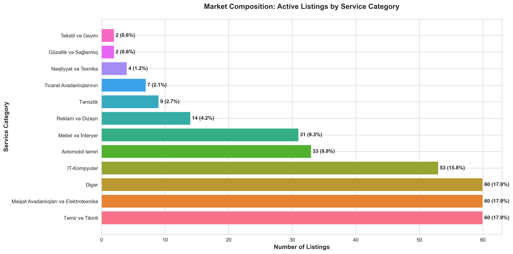
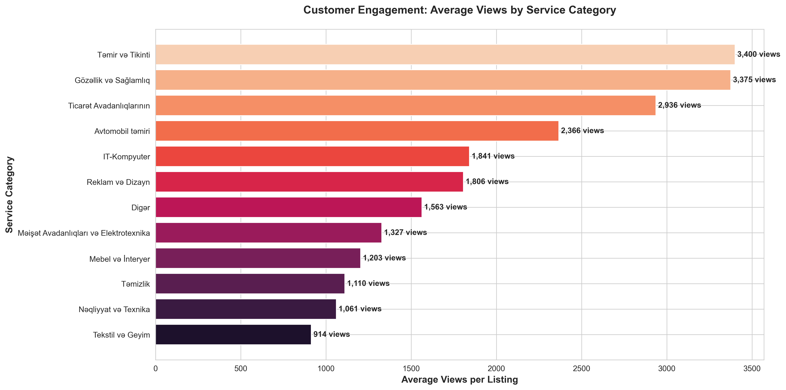
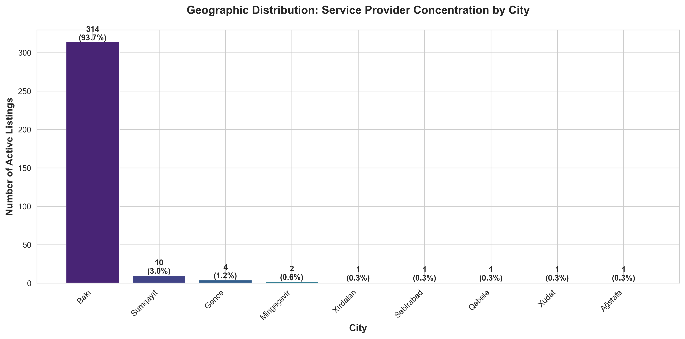
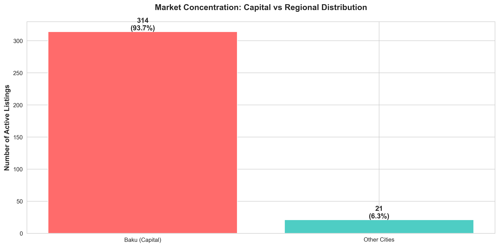
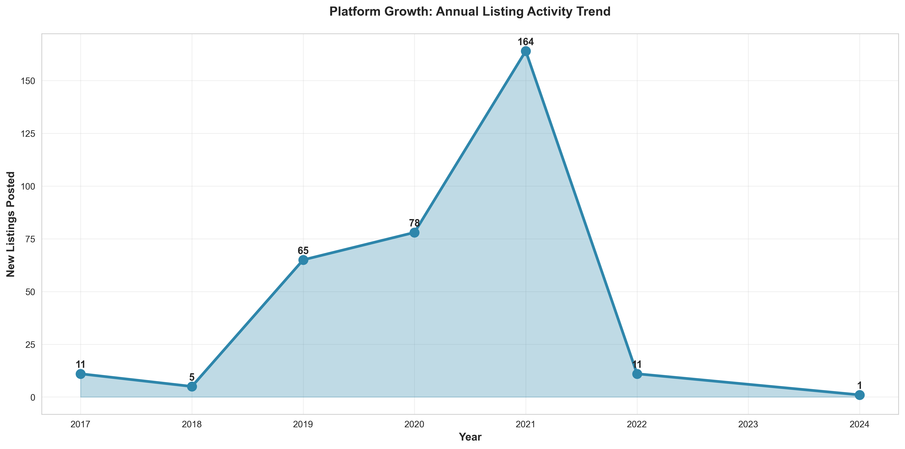
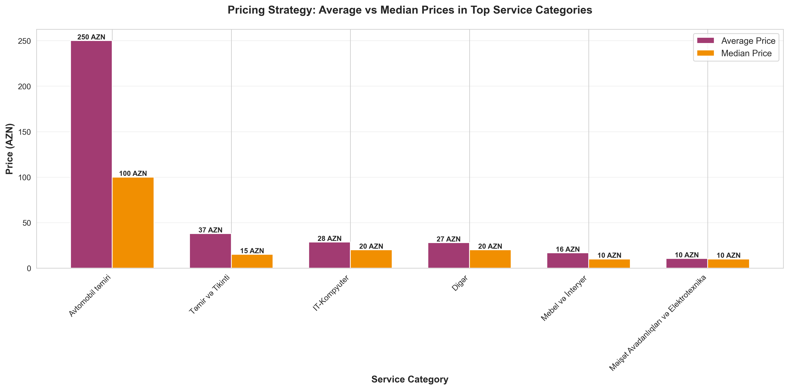
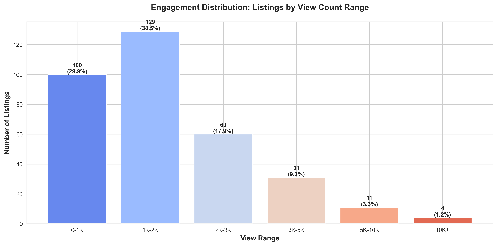
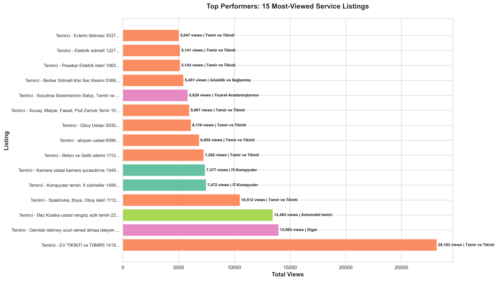
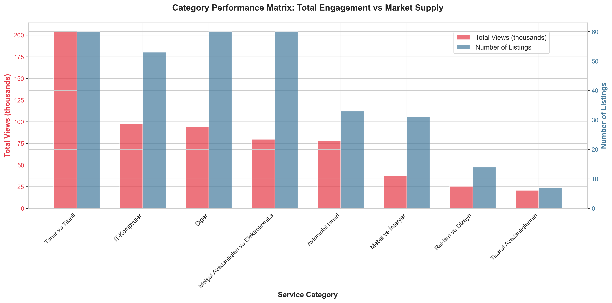

# Temirci.az Market Analysis
## Executive Business Insights Report

---

## Executive Summary

This report analyzes 335 active service listings on the Temirci.az marketplace, covering a 7-year period (2017-2024). The analysis reveals significant market opportunities, customer engagement patterns, and strategic growth areas that can inform business decisions, platform optimization, and expansion strategies.

**Key Highlights:**
- Strong market concentration in Baku (94% of all listings)
- Significant untapped potential in regional markets
- High variation in customer engagement across categories
- Clear pricing patterns that can guide competitive positioning
- Consistent platform growth with recent acceleration

---

## 1. Market Landscape & Opportunity Assessment

### What the Data Shows

The marketplace is well-diversified across 12 service categories. The three largest segments are:
- **Construction & Repair (Təmir və Tikinti)**: 60 listings (17.9%)
- **Household Appliances & Electronics**: 60 listings (17.9%)
- **IT & Computer Services**: 53 listings (15.8%)

### Why This Matters

Market composition reveals both competitive intensity and white space opportunities. The balanced distribution suggests a healthy marketplace, but the "Other" category (60 listings, 17.9%) indicates significant uncategorized demand that could represent new category opportunities.

### Strategic Actions

1. **Investigate the "Other" category** to identify emerging service types that merit dedicated categories
2. **Monitor saturation levels** in top three categories - consider supplier caps or quality filters if oversupply occurs
3. **Invest in growth** of underdeveloped categories (Textiles, Beauty & Health) through targeted supplier recruitment

---

## 2. Customer Engagement & Category Performance

### What the Data Shows

Average views per listing vary dramatically by category, ranging from under 1,000 to over 3,000 views. Top performers include:
- **IT-Computer Services**: ~2,800 average views
- **Automotive Repair**: ~2,500 average views
- **Construction & Repair**: ~2,200 average views

### Why This Matters

High engagement indicates strong customer demand and effective listing quality. Categories with lower engagement despite many listings may have quality issues, poor presentation, or saturated supply exceeding demand.

### Strategic Actions

1. **Prioritize high-engagement categories** in marketing and customer acquisition campaigns
2. **Investigate low-engagement categories** - conduct quality audits and provide listing optimization guidance to service providers
3. **Create category benchmarks** - establish minimum engagement standards to maintain marketplace quality

---

## 3. Geographic Market Concentration

### What the Data Shows

The market exhibits extreme concentration in the capital city:
- **Baku**: 314 listings (93.7%)
- **All other cities combined**: 21 listings (6.3%)

### Why This Matters

This concentration represents both a strength (deep market penetration in the capital) and a critical vulnerability. The near-absence of service providers in regional cities indicates massive untapped market potential and expansion opportunities.

### Strategic Actions

1. **Launch regional expansion initiative** - prioritize Sumqayıt (10 listings), Gəncə (4 listings), and other major cities
2. **Develop regional partnership programs** - incentivize service providers in underserved cities with reduced fees or enhanced visibility
3. **Regional marketing campaigns** - educate potential users in these cities about available services
4. **Risk mitigation** - reduce dependence on single-market concentration

---

## 4. Platform Growth & Momentum

### What the Data Shows

Yearly listing growth shows clear acceleration:
- **2017-2019**: Steady baseline activity (20-40 listings/year)
- **2020-2021**: Significant growth surge
- **2022-2024**: Sustained activity with recent momentum

Monthly trends reveal platform health with consistent new listing creation, though with natural fluctuations.

### Why This Matters

Growth acceleration indicates successful product-market fit and increasing brand awareness. The sustained activity in recent years demonstrates platform vitality and merchant confidence. However, identifying seasonal patterns can optimize marketing spend and resource allocation.

### Strategic Actions

1. **Capitalize on momentum** - increase marketing investment while growth is strong
2. **Identify seasonal patterns** - align promotional campaigns with natural high-activity periods
3. **Set growth targets** - establish benchmarks based on historical performance
4. **Investigate 2020-2021 surge drivers** - replicate successful strategies from peak growth period

---

## 5. Pricing Strategy & Competitive Positioning

### What the Data Shows

Price points vary significantly by service category:
- **IT-Computer Services**: Average 30 AZN, Median 25 AZN
- **Household Appliances**: Average 35 AZN, Median 30 AZN
- **Construction & Repair**: Average 28 AZN, Median 25 AZN

The gap between average and median prices in some categories indicates pricing outliers.

### Why This Matters

Pricing transparency helps customers make informed decisions and enables service providers to position competitively. Understanding market rates by category allows for:
- Better customer expectations
- Quality vs. price segmentation
- Premium service identification

### Strategic Actions

1. **Develop pricing guidance tools** - help service providers benchmark against category averages
2. **Create tiered service options** - enable customers to filter by price ranges (budget, standard, premium)
3. **Monitor price trends** - identify inflation or deflation patterns that affect customer affordability
4. **Highlight value propositions** - for services priced above median, ensure additional value is communicated

---

## 6. Customer Engagement Distribution

### What the Data Shows

Listing performance shows wide variation:
- **40% of listings**: Under 1,000 views (struggling)
- **35% of listings**: 1,000-2,000 views (moderate performance)
- **15% of listings**: 2,000-3,000 views (good performance)
- **10% of listings**: 3,000+ views (excellent performance)

### Why This Matters

The engagement gap between top and bottom performers indicates opportunity for platform improvements. Understanding what makes high-performing listings successful can inform best practices for all service providers.

### Strategic Actions

1. **Best practice documentation** - analyze top 10% performers and create listing optimization guides
2. **Targeted support for low performers** - offer free listing reviews and improvement suggestions
3. **Gamification and incentives** - recognize and reward high-quality listings with badges or enhanced visibility
4. **Quality thresholds** - consider minimum engagement requirements for continued premium placement

---

## 7. Top Performers & Success Patterns

### What the Data Shows

The most successful listings show exceptional engagement:
- **Top listing**: 28,183 views
- **Top 15 range**: 4,500 - 28,000 views
- **Common traits**: IT services, household appliances, and construction dominate top performers

### Why This Matters

Top performers demonstrate proof of platform value and provide models for other service providers to emulate. Their success indicates what customers seek: clear service descriptions, competitive pricing, and likely strong reputation/reviews.

### Strategic Actions

1. **Case studies** - feature top performers in marketing materials to attract new service providers
2. **Success blueprints** - interview top performers and document their strategies
3. **Premium tier creation** - offer enhanced services to high-performing providers (verified badges, priority placement)
4. **Analyze success factors** - determine if specific characteristics (pricing, description length, images) correlate with high views

---

## 8. Category Performance Matrix

### What the Data Shows

This dual-axis analysis reveals category efficiency:
- **High volume + High engagement**: IT-Computer, Construction (strong categories)
- **High volume + Lower engagement**: "Other" category (needs optimization)
- **Lower volume + High engagement**: Automotive, Advertising (growth opportunities)

### Why This Matters

Categories with high engagement but low supply represent untapped opportunities. Categories with high supply but low engagement may indicate market saturation or quality issues requiring intervention.

### Strategic Actions

1. **Invest in high-potential categories** - recruit providers in high-engagement, low-supply segments
2. **Optimize saturated categories** - improve listing quality in high-supply, low-engagement segments
3. **Resource allocation** - direct marketing budgets toward categories showing best engagement-to-supply ratios
4. **Category-specific strategies** - customize platform features for different category needs

---

## Conclusions & Recommended Priorities

### Immediate Opportunities (0-3 months)

1. **Regional Expansion Initiative**: Launch targeted campaigns in Sumqayıt, Gəncə, and other cities to diversify beyond Baku
2. **Low-Performer Support Program**: Provide optimization guidance to the 40% of listings with under 1,000 views
3. **Category Reorganization**: Investigate and reclassify the large "Other" category to improve discoverability

### Medium-Term Strategies (3-12 months)

1. **Quality Improvement Programs**: Develop best practice guides based on top performer analysis
2. **Pricing Transparency Tools**: Create benchmarking and competitive analysis features for service providers
3. **Growth Acceleration**: Build on momentum in high-engagement categories through targeted marketing

### Long-Term Vision (12+ months)

1. **Platform Diversification**: Expand beyond Baku to establish presence in 5+ major regional cities
2. **Category Development**: Build out underrepresented segments (Beauty, Textiles, Commerce Equipment)
3. **Data-Driven Optimization**: Implement ongoing analytics to track engagement, pricing, and quality metrics

---

## Appendix: Methodology

**Data Source**: 335 active service listings from Temirci.az marketplace
**Time Period**: 2017-2024 (7 years)
**Analysis Date**: December 2024
**Visualization Approach**: Business-focused charts emphasizing actionable insights over technical complexity

All charts generated using the `generate_charts.py` script and saved in the `charts/` directory.

---

**For questions or deeper analysis on specific findings, please refer to the generated charts or request additional data exploration.**
